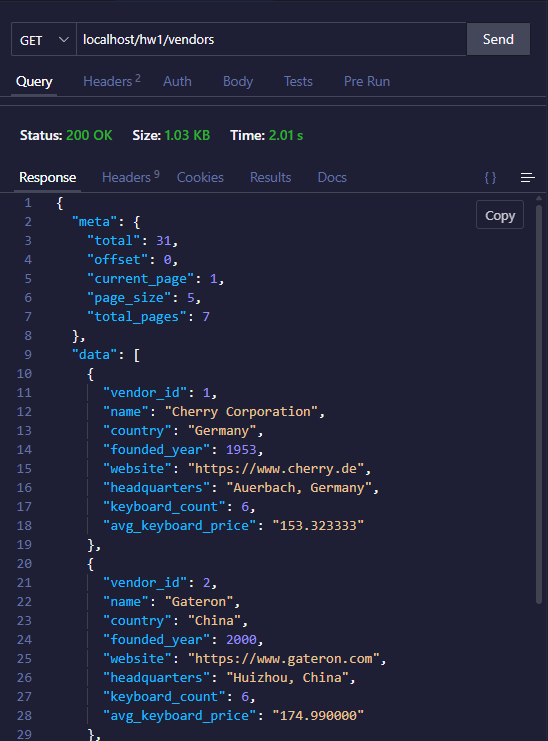
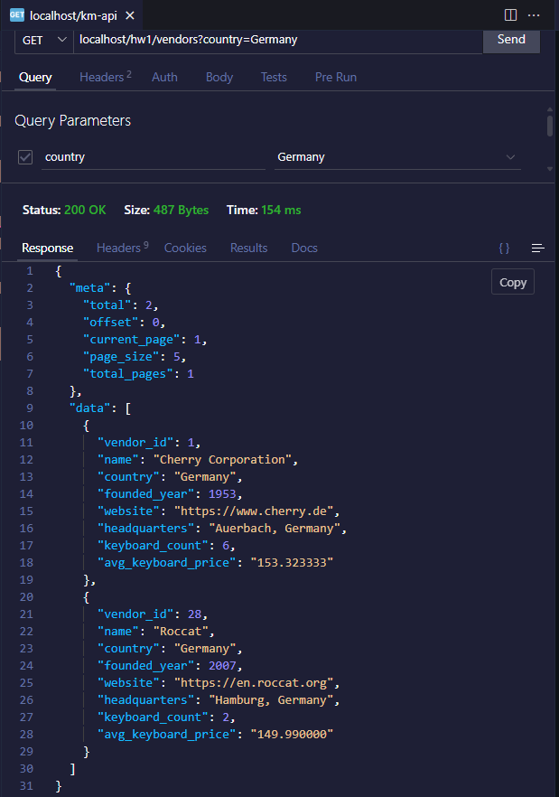
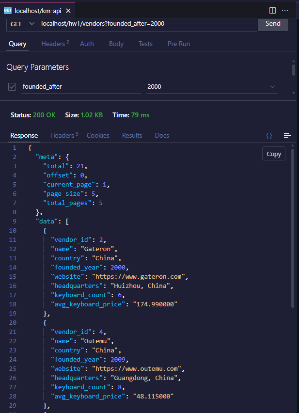
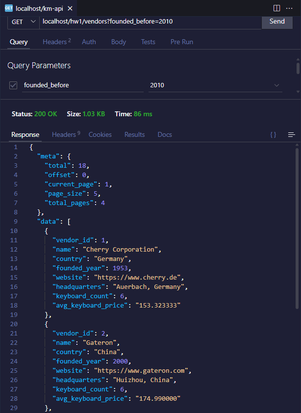
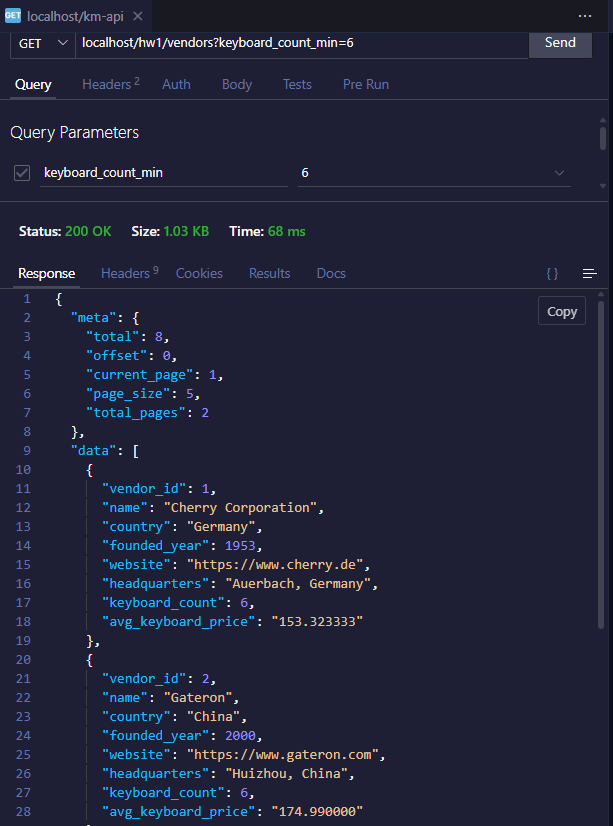
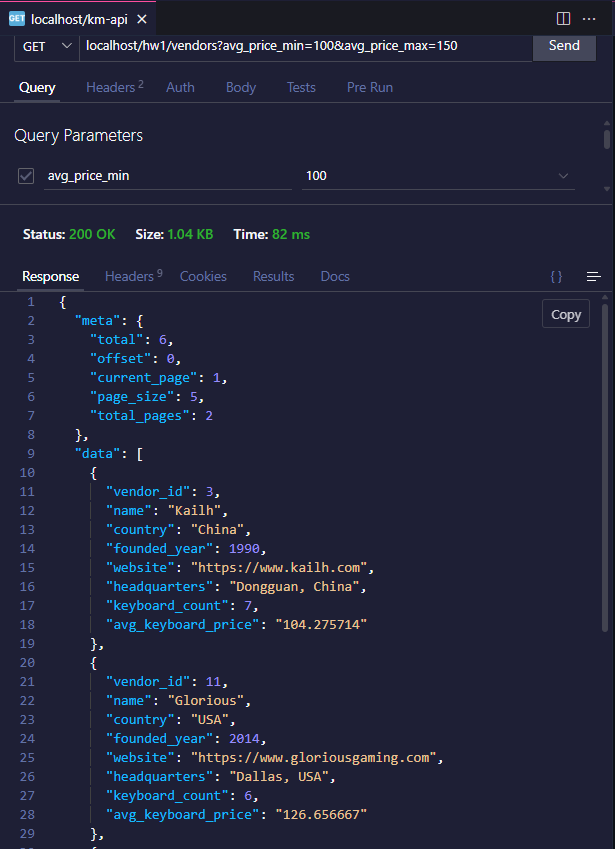

# Testing Guide for REST API Assignment
This guide will show the documentation of testing the resources of this homework.

## Base URL
All requests use: `http://localhost/hw1`

---
## 1. Vendors Collection
### GET /vendors
**Description:** Get all vendors

**Basic Request:**
```
GET http://localhost/hw1/vendors
```

**With Filters:**

```
GET http://localhost/hw1/vendors?country=Germany
```



```
GET http://localhost/hw1/vendors?founded_after=2000
```


```
GET http://localhost/hw1/vendors?founded_before=2010
```


```
GET http://localhost/hw1/vendors?keyboard_count_min=6
```


```
GET http://localhost/hw1/vendors?avg_price_min=100&avg_price_max=150
```


** With Pagination **
```
GET http://localhost/hw1/vendors?page=1&page_size=10
```
Response:
```json
{
  "meta": {
    "total": 31,
    "offset": 0,
    "current_page": 1,
    "page_size": 5,
    "total_pages": 7
  },
  "data": [
    {
      "vendor_id": 1,
      "name": "Cherry Corporation",
      "country": "Germany",
      "founded_year": 1953,
      "website": "https://www.cherry.de",
      "headquarters": "Auerbach, Germany",
      "keyboard_count": 6,
      "avg_keyboard_price": "153.323333"
    },
    {
      "vendor_id": 2,
      "name": "Gateron",
      "country": "China",
      "founded_year": 2000,
      "website": "https://www.gateron.com",
      "headquarters": "Huizhou, China",
      "keyboard_count": 6,
      "avg_keyboard_price": "174.990000"
    },
    {
      "vendor_id": 3,
      "name": "Kailh",
      "country": "China",
      "founded_year": 1990,
      "website": "https://www.kailh.com",
      "headquarters": "Dongguan, China",
      "keyboard_count": 7,
      "avg_keyboard_price": "104.275714"
    },
    {
      "vendor_id": 4,
      "name": "Outemu",
      "country": "China",
      "founded_year": 2009,
      "website": "https://www.outemu.com",
      "headquarters": "Guangdong, China",
      "keyboard_count": 8,
      "avg_keyboard_price": "48.115000"
    },
    {
      "vendor_id": 5,
      "name": "Razer",
      "country": "Singapore",
      "founded_year": 2005,
      "website": "https://www.razer.com",
      "headquarters": "Irvine, USA",
      "keyboard_count": 6,
      "avg_keyboard_price": "159.990000"
    }
  ]
}
```

** Combined **
```
GET http://localhost/hw1/vendors?country=Germany&founded_after=1990&page=1&page_size=5
```
Response:
```json
{
  "meta": {
    "total": 1,
    "offset": 0,
    "current_page": 1,
    "page_size": 5,
    "total_pages": 1
  },
  "data": [
    {
      "vendor_id": 28,
      "name": "Roccat",
      "country": "Germany",
      "founded_year": 2007,
      "website": "https://en.roccat.org",
      "headquarters": "Hamburg, Germany",
      "keyboard_count": 2,
      "avg_keyboard_price": "149.990000"
    }
  ]
}
```
